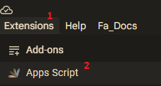
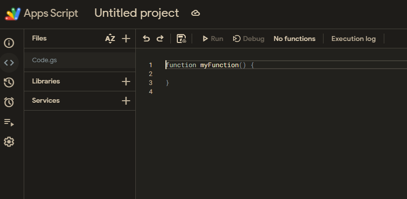
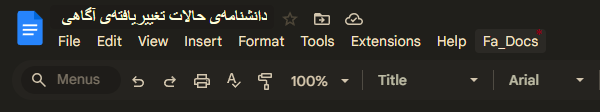

# 🇮🇷 Fa_Docs | گوگل فاکس

A Google Docs add-on that brings **Persian (Farsi) support** and typography tools directly into Google Docs.  
Currently, Farsi Tools provides **advanced Persian numbering** for lists and documents — with full right-to-left compatibility and customizable styles.

> ✨ More tools for Persian writers and editors will be added in future updates!

---

## 🧩 Features

### ✅ Current Feature
**Persian Numbering (شمار‌گذار فارسی)**  
- Supports Persian digits (۱,۲,۳) and Persian/Arabic alphabetic styles (ا،ب،پ / الف،ب،ج)  
- Customizable **prefix** and **suffix** for numbering  
- Automatically aligns text **RTL** when Persian is detected  
- Works directly inside Google Docs via a **sidebar interface**

### 🔜 Upcoming Features
- Persian date/time insertion (e.g., ۱۴۰۴/۰۷/۲۸)  
- Persian punctuation correction  
- Word counter & character analyzer for Persian text
- Persian page numbering
- Automatic indexing with Persian numerals

---

## 🚀 Installation (Developer Mode)

If you want to run or modify Farsi Tools manually:

1. Go to [script.google.com](https://script.google.com/).
2. Create a new project and copy the files from this repository (`Code.gs`, `Sidebar.html`, and `appsscript.json`).
3. Save the project.
4. Open a Google Docs document → Extensions → Apps Script → Run `onOpen`.
5. You’ll see a **"Farsi Tools"** menu → Click → Open the sidebar.

> 💡 Note: To deploy it publicly, link the Apps Script project to a **user-managed Google Cloud Project**, then configure the OAuth consent screen and publish to the **Google Workspace Marketplace**.

---

## 🧰 Tech Stack

- **Google Apps Script** (JavaScript-based)
- **Google Docs Add-ons API**
- **HTML/CSS Sidebar UI**

---

## 🧑‍💻 Contributing

Contributions are welcome!  
If you’d like to suggest or develop a new tool (e.g., grammar fixer, Persian transliterator, etc.), open an issue or submit a pull request.

---

## 📄 License

MIT License © 2025 — Developed by Ali Ghorbani

## 🇮🇷 فارسی

### معرفی
افزونه‌ی **FA_Docs** برای Google Docs، مجموعه‌ای از ابزارهای فارسی‌نویسی و ویرایش متن را به محیط گوگل داکس اضافه می‌کند.  
در حال حاضر تنها ابزار فعال، **شمار‌گذار فارسی** است، اما در به‌روزرسانی‌های آینده ابزارهای بیشتری افزوده خواهند شد.

---

### ✳️ ویژگی‌های فعلی
**شمار‌گذار فارسی**  
- پشتیبانی از اعداد فارسی (۱،۲،۳) و حروف الفبا (الف،ب،پ،ت / الف،ب،ج،د)  
- امکان تعیین پیشوند و پسوند دلخواه  
- اجرای مستقیم در Google Docs 
---

### 🔜 در نسخه‌های آینده
- درج تاریخ شمسی  
- شماره‌گذاری فارسی صفحه
- درج فهرست فارسی
- تصحیح علائم نگارشی فارسی  
- شمارنده کلمات و حروف فارسی  

---

### 🧩شیوه‌ی استفاده
1. در Google Docs از منوی **Extensions → Apps Script** را باز کنید.

2. وارد چنین صفحه‌ای می‌شوید:

3. می‌بینید که در صفحه‌ی باز شده، به صورت پیش‌فرض فایل code.gs باز است. محتوای آن را با محتوای موجود در code.gs که خدمت شما آماده کرده‌ام جایگزین کنید.

4. در همان صفحه گزینه‌ی + را زده و گزینه‌ی html را بزنید؛ نام آن فایل جدید را Slidebar گذاشته و محتوای آن را با Slidebar.html که خدمت شما آماده کرده‌ام جایگزین کنید. 
5. گزینه‌ی Deploy یا run را با تنظیمات دلخواه بزنید. (این مرحله زیاد مهم نیست فقط با اون دوتا گزینه ور برید تا ازتون مجوز دسترسی بگیره و بعدش فعال می‌شه افزونه.) 
6. پروژه‌ی خود در گوگل داگز را رفرش کنید؛ در صورت مشاهده‌ی Fa_Docs در منوی ابزار در کنار help به شکل زیر:

عملیات با موفقیت نجام شده است!

---
 

---

### 🧑‍💻 مشارکت
از هرگونه پیشنهاد یا کمک در توسعه‌ی ابزارهای جدید (مثل اصلاح‌گر نگارشی یا تبدیل‌گر متون) استقبال می‌شود.  
برای همکاری، لطفاً یک issue یا pull request ثبت کنید.

---

### 📄 مجوز
منتشر شده تحت مجوز **MIT License © 2025**  
توسعه‌دهنده: علی قربانی

---# Fa_Docs
Farsi Tools for Google Docs
